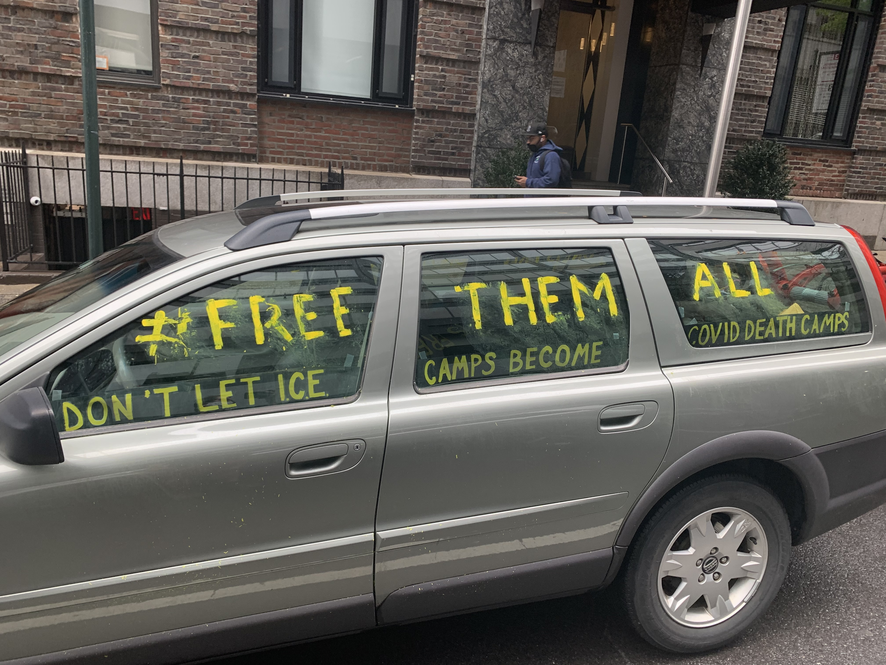

## Organizing in Bristol Immigration Jail during COVID-19
In mid-March 2020, immigrants who were facing deportation proceedings and locked up in the Bristol County House of Corrections — a jail in Massachusetts — were extremely concerned about the possibility of contracting COVID-19 during the global pandemic. 

> #FreeThemAll Car+Bike Demo in NYC: Say No To Death Camps
Car And Bike and Pedestrian Caravan Demanded Cuomo Release ICE Detainees During Covid-19 Pandemic, Plus Reduce Jail And Prison Populations. Photo viahoto vi [Andrew Ratto / Flickr](https://www.flickr.com/photos/tags/FreeThemAll)

After they observed two corrections officers exhibiting COVID-19 symptoms, the people who were detained began to organize. Despite speaking different languages, people in one wing of the jail were nonetheless able to collectively draft a [letter](https://d279m997dpfwgl.cloudfront.net/wp/2020/03/BHOC-EMERGENCY.pdf) describing the “overcrowded living conditions” that forced 57 people to share an area meant for ten, and “the reckless behavior” of the guards. In spite of the threat of retaliation from ICE and jail administrators, fifty-one incarcerated immigrants signed the letter, demanding release and/or bond hearings for those with serious medical conditions. 

<iframe class="scribd_iframe_embed" title="50 Bristol County immigrant detainees send letter to public officials over COVID-19 concerns" src="https://www.scribd.com/embeds/452559243/content?start_page=1&view_mode=scroll&access_key=key-uxwyqir9GNcVhC2uMp51" data-auto-height="true" data-aspect-ratio="0.7598989048020219" scrolling="no" width="100%" height="600" frameborder="0"></iframe>

> 50 Bristol County immigrant detainees send letter to public officials over COVID-19 concerns"

The letter from the immigrants mobilized groups on the outside, who were already organized to do short- and long-term work with people locked up. The Connecticut Immigrant Bail Fund, through its efforts to establish a pilot program that would guarantee legal representation to Connecticut residents in deportation proceedings and in immigration prison, had built relationships with attorneys who regularly visited detention centers in multiple New England states. It was one of these lawyers who was able to leak the immigrants’ letter, and then continue to liaise with the authors even after the jail staff and sheriff retaliated and locked down the facility. Similarly, the [Boston Immigration Justice Accompaniment Network](https://www.beyondbondboston.org/) ran a hotline which was well known to people inside, and maintained communication with immigrants in spite of pandemic restrictions on in-person visits. 

> TK TK

As attorneys across the country began filing habeas and class action lawsuits to free as many people as possible from immigration prisons, they relied on descriptions of conditions obtained from those organizing inside the Bristol County House of Corrections. Their testimonies were instrumental to winning a federal judge’s order, which released 50 people out of a total of 148 people in detention.  

> TK TK

This hard-won freedom came at a high cost. When inside organizers resisted being moved to another cell within the coronavirus-stricken facility, the Bristol County Sheriff and his deputies unleashed pepper spray, dogs, and riot gear to [attack](https://commonwealthmagazine.org/immigration/recordings-of-detainees-at-bristol-jail-released/) the unit where detainees had organized.

One terrified caller described the scene to Rev. Annie Gonzalez Milliken, a pastor with the Boston Immigration Justice Accompaniment Network: “The sheriff approached me violently, grabbed my arm and scratched me, police came with pepper spray, spraying in everyone’s face and spraying in my mouth, and I suffer asthma. And then they retreated, a lawyer was on the phone and he witnessed everything, they cut off all the phones except two are still working. They’re outside with the canine unit, bullet proof vests, and riot gear. The sheriff attacked me, he was out of his mind, I saw the devil in his eyes.”

> TK TK

Even after being released from detention by court order, immigrant leaders who organized behind bars continued to be targeted outside. ICE is aggressively pursuing those individuals, and trying to revoke their bail, rearrest or deport them.

One organizer, who was made to wear a GPS tracking device as part of his release conditions from the immigration prison in Bristol County, was given contradictory information from ICE’s ISAP program and the jail on whether he was on house arrest or allowed to go to work. He had his bail revoked and was deported in June.

> TK TK

Still, the ongoing efforts from detained people continue to bring outside groups together, said Ana María Rivera-Forastieri from Connecticut Immigrant Bail Fund. “They’ve organized us so well,” she said. “We are going to start doing bi-weekly meetings with families of those released.” 

