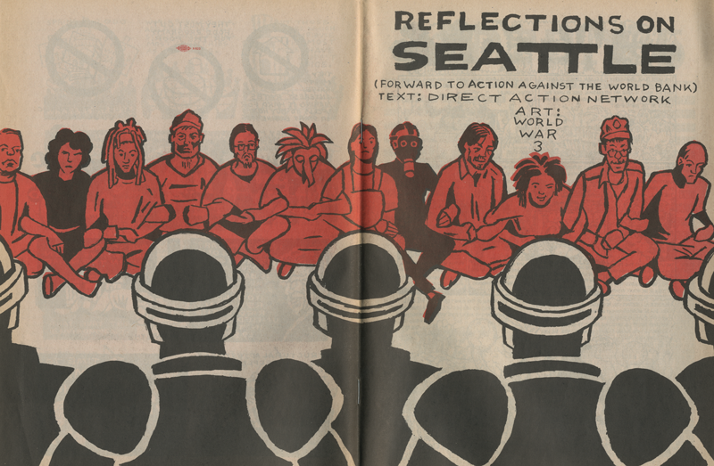
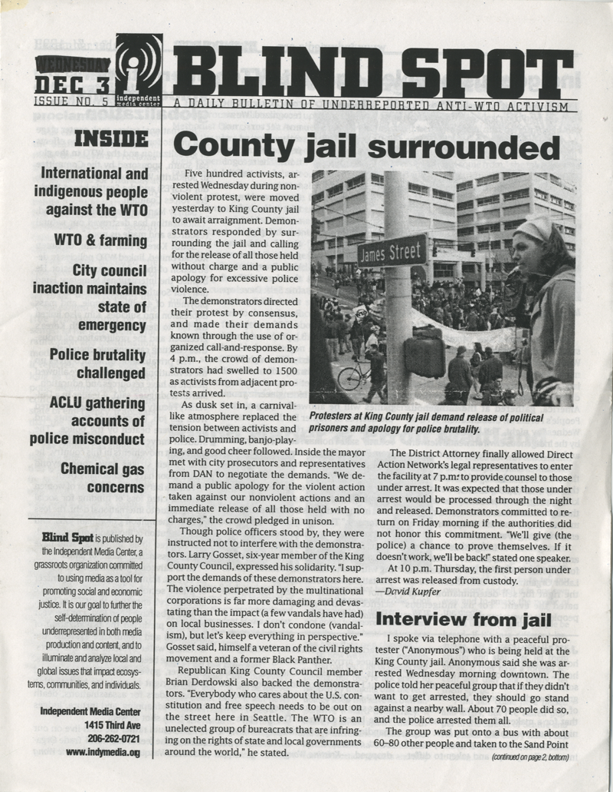
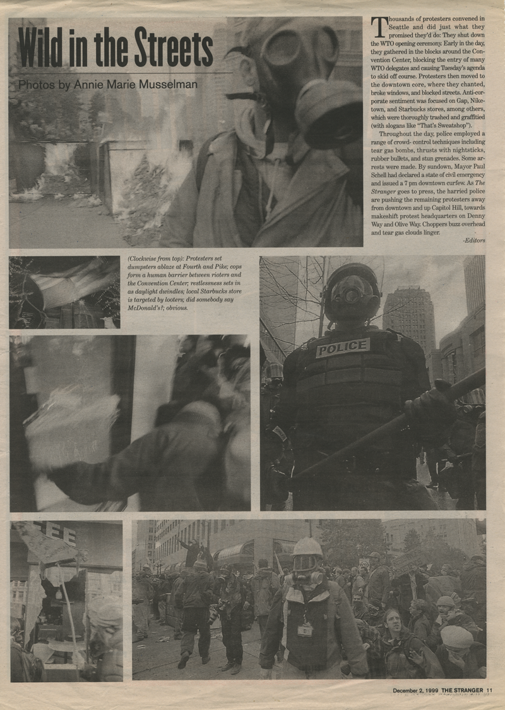

> All photos via Inteference Archive.

Collective negotiation and mass non-cooperation yielded different results at two mass mobilizations in Seattle and Washington, DC.

> TK TK 

In November 1999, after about 600 people were arrested in retaliation for the successful disruption of downtown Seattle and the subsequent breakdown of trade talks, activists used the tactic of court solidarity after attempts of jail solidarity failed. 

> TK TK 

Katya Komisaruk, an attorney on the legal team for the Direct Action Network (DAN), one of the groups mobilizing against the WTO, had brought lessons from her involvement in the anti-nuclear movement of the 1980s. In Seattle, in the weeks leading up to the WTO protest, she led legal trainings that prepared protest participants to leave their IDs at home and, if arrested, refuse to give their names to the police at the point of booking.

> TK TK 

To make identification even harder for jail authorities, arrestees traded clothing and wristbands with each other while in custody. Jail staff responded with violence, and the city refused to negotiate while the protesters were locked up. So after four days, the vast majority of the protesters gave their names in order to be released together, and vowed to fight in court instead. 

> TK TK 

With the support of the DAN legal team, the protesters collectively demanded individual jury trials. According to Komisaruk, only 7% of those arrested took plea deals: “As the window for speedy trials narrowed, 92% of the cases were dropped. In the last few weeks before the statutory limit, the prosecution chose six cases to bring to trial. Five of these defendants were acquitted or dismissed. The only activist who was convicted was sentenced to community service and a small fine.”

